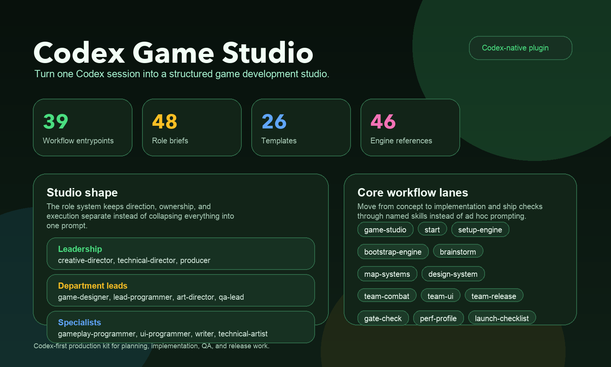
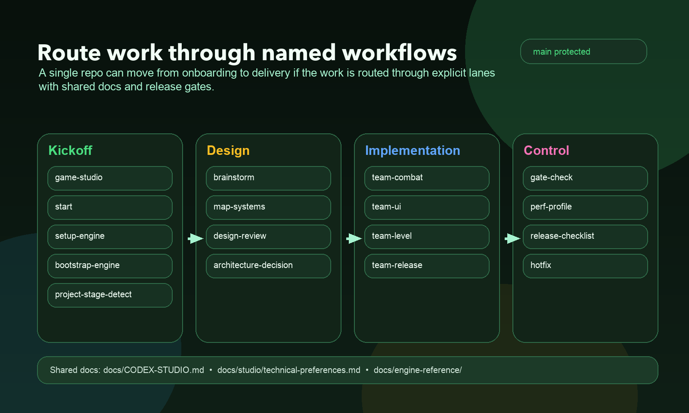
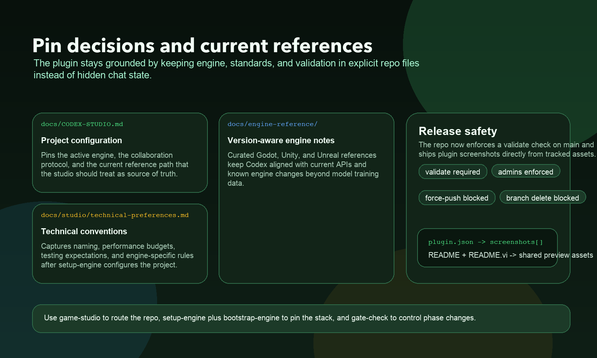

<p align="center">
  <h1 align="center">Codex Game Studio</h1>
  <p align="center">
    Turn one Codex session into a structured game development studio.
    <br />
    39 workflows. 48 role briefs. One Codex-first production kit.
  </p>
</p>

<p align="center">
  <a href="LICENSE"></a>
  <a href="plugins/codex-game-studio/skills"></a>
  <a href="plugins/codex-game-studio/references/roles"></a>
  <a href="plugins/codex-game-studio/references/templates"></a>
  <a href="docs/engine-reference"></a>
  <a href="plugins/codex-game-studio/.codex-plugin/plugin.json"></a>
</p>

<p align="center">
  <strong>English</strong> · <a href="README.vi.md">Tiếng Việt</a>
</p>

> This repository is a Codex-native port of the original
> [`Donchitos/Claude-Code-Game-Studios`](https://github.com/Donchitos/Claude-Code-Game-Studios),
> cleaned and reorganized to feel native in Codex.

## Why This Exists

Game projects benefit from structure, but a plain chat session rarely gives you
clear lanes for design, implementation, review, production planning, and
release work. This repo turns that loose interaction into a more disciplined
studio model for Codex.

You still make the decisions. The repo gives Codex a stronger operating shape:
named workflows, reusable role briefs, document templates, and engine-specific
reference notes.

## What's Included

| Category | Count | Description |
|----------|-------|-------------|
| **Workflows** | 39 | Codex skill entrypoints for planning, reviews, production, implementation, and release |
| **Role Briefs** | 48 | Domain-specific specialist briefs for design, programming, art, QA, production, and engine work |
| **Templates** | 26 | Reusable docs for GDDs, ADRs, milestones, retrospectives, release work, and reverse-documentation |
| **Engine References** | 46 | Version-aware notes for Godot, Unity, and Unreal |

## Studio Shape

The role library keeps the same three-level studio structure:

| Tier | Focus | Examples |
|------|-------|----------|
| **Leadership** | Direction and conflict resolution | `creative-director`, `technical-director`, `producer` |
| **Department Leads** | Domain ownership | `game-designer`, `lead-programmer`, `art-director`, `qa-lead` |
| **Specialists** | Hands-on execution | `gameplay-programmer`, `ui-programmer`, `writer`, `technical-artist`, `qa-tester` |

These roles live in `plugins/codex-game-studio/references/roles/` and are used
as Codex role briefs rather than product-native subagent types.

## Main Workflows

**Project setup**

`game-studio` `start` `setup-engine` `bootstrap-engine` `project-stage-detect`

**Design and planning**

`brainstorm` `map-systems` `design-system` `design-review` `architecture-decision` `estimate`

**Implementation teams**

`team-combat` `team-ui` `team-level` `team-narrative` `team-audio` `team-polish` `team-release`

**Reviews and operations**

`code-review` `perf-profile` `balance-check` `asset-audit` `scope-check` `tech-debt` `release-checklist` `launch-checklist` `hotfix`

## Preview

<p align="center">
  
</p>

<table>
  <tr>
    <td width="50%">
      
    </td>
    <td width="50%">
      
    </td>
  </tr>
  <tr>
    <td>Named workflow lanes for onboarding, design, implementation, and release control.</td>
    <td>Shared docs, engine references, and validation rules that keep Codex grounded.</td>
  </tr>
</table>

## Quick Start

1. Open this repository in Codex and let it load the local marketplace from `.agents/plugins/marketplace.json`.
2. Confirm the `codex-game-studio` plugin is available. If the plugin list looks stale, reopen the workspace so Codex reloads local plugins.
3. Start with one of these prompts:

   ```text
   Use game-studio to route this repo
   Run start and onboard me from scratch
   Use setup-engine for a Godot project, then run bootstrap-engine
   ```

4. Keep shared studio decisions in `docs/CODEX-STUDIO.md`.
5. Keep engine-specific conventions in `docs/studio/technical-preferences.md`.
6. Run `bootstrap-engine` once the engine is pinned and you need real runtime files.
7. Use the workflow skills directly once the project is underway.

## Repository Layout

```text
.
├── .agents/plugins/marketplace.json
├── docs/
│   ├── CODEX-STUDIO.md
│   ├── studio/technical-preferences.md
│   └── engine-reference/
├── plugins/
│   └── codex-game-studio/
│       ├── .codex-plugin/plugin.json
│       ├── skills/
│       ├── references/roles/
│       ├── references/templates/
│       └── references/studio/
└── production/session-state/
```

## Typical Flow

1. Start with `game-studio` if you want routing, or `start` if the repo is still a blank slate.
2. Run `setup-engine` once to pin the engine, language, and reference path.
3. Run `bootstrap-engine` to create the real runtime scaffold for Godot, Unity, or Unreal.
4. Use planning skills such as `brainstorm`, `map-systems`, `design-system`, and `architecture-decision`.
5. Move into implementation with the `team-*` workflows that fit the current slice of work.
6. Use `gate-check`, `release-checklist`, `launch-checklist`, and `hotfix` to control later phases.

## Core Files

- `plugins/codex-game-studio/.codex-plugin/plugin.json`
- `.agents/plugins/marketplace.json`
- `docs/CODEX-STUDIO.md`
- `docs/studio/technical-preferences.md`
- `plugins/codex-game-studio/references/roles/`
- `plugins/codex-game-studio/references/templates/`
